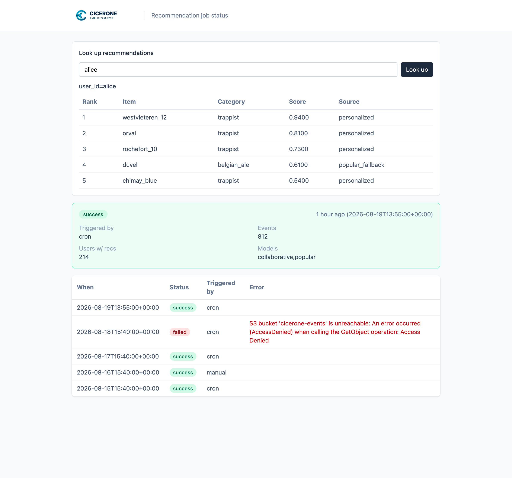

# Cicerone

[](https://github.com/torbido-hq/cicerone/actions/workflows/ci.yml)
[](https://github.com/torbido-hq/cicerone/actions/workflows/codeql.yml)
[](https://www.python.org/downloads/release/python-3110/)
[](LICENSE)
[](https://cicerone.dev)
[](https://pypi.org/project/cicerone-recommender/)

**Site:** [cicerone.dev](https://cicerone.dev)
([Starlight](https://starlight.astro.build/) docs site; source in [`website/`](website/),
guides synced from [`docs/`](docs/). [Articles](https://cicerone.dev/articles/).)

A generic, self-hosted batch recommender system. It reads your interaction
data, trains a hybrid [rectools](https://github.com/MobileTeleSystems/RecTools)
+ LightFM model (optional item-KNN, SASRec/BERT4Rec/HSTU, popular/latest), and
writes out top-K recommendations per user. An optional lightweight "serve"
mode can then expose those precomputed recommendations over a small
read-only HTTP API — there's still no live inference, no model loaded in the
request path. Optional `[events]` ingest can refresh popular/latest rows
between full retrains; `[events.online]` can also continue LightFM for
affected users. That is still write-through, not request-path
ranking ([docs/incremental-events.md](docs/incremental-events.md)). How the
strategies differ, with paper links:
[docs/how-it-works.md](docs/how-it-works.md). Optionally
(`[job].save_model_artifact`), the batch job can also write a versioned
fitted-model artifact for offline reload / future thin inference without
redesigning training. The supported deploy path is Docker (Python 3.11 lives
inside the image). A PyPI package is also published for Python 3.11 hosts —
see Installation.

Cicerone isn't tied to any particular product, shop, or domain — it works
for any catalog of "users" and "items" with interaction events (purchases,
views, reviews, ...): drinks, books, courses, tracks, you name it. Input and
output are pluggable and configured through a single TOML file, so wiring it
up to your own data doesn't require touching any code.

## Features

- **Batch recommender** — cron-scheduled train + top-K write (dataset or DB I/O)
- **Hybrid strategies** — collaborative (LightFM), item-based KNN, optional SASRec/BERT4Rec/HSTU, optional content cold-item fallback, popular, latest
- **Priority, RRF, or blending** — combine strategies by order, weighted ranks, or per-user mix
- **A/B experiments** — sticky user assignment across whole ranking recipes; sequential CIs, catalog guardrails, optional AutoML challenger, dashboard promote
- **AutoML** — time-fold backtest to pick models/weights per run
- **Business policies** — TOML eligibility filters and score boosts
- **Serve mode** — read-only HTTP API over precomputed recommendations
  (`limit` / `category` / `exclude_unavailable`, cold-start fallback;
  OpenAPI at `/docs` + thin `ServeClient`)
- **Incremental events** — write-through of popular/latest between retrains;
  optional `[events.online]` continues LightFM for affected users
  ([docs/incremental-events.md](docs/incremental-events.md))
- **CLI / PyPI** — `cicerone` console script; `pip install cicerone-recommender`
  (import name `cicerone`; the PyPI name `cicerone` is a different project)
- **Retrain trigger** — webhook (+ optional input poll) alongside cron
- **Dashboard** — Basic-Auth status page for run success/failure, history, user-id lookup, and experiment promote
- **Model artifacts** — optional versioned fitted-model bundle for offline reload

> **Why "Cicerone"?** In the world of beer, a [Cicerone](https://www.cicerone.org)
> is a certified expert on beer's history, styles, ingredients, brewing, and
> — most importantly — what to pair or recommend for a given taste. Think of
> it as the beer world's equivalent of a wine sommelier. It felt like a
> fitting name for a project whose whole job is recommending the right drink
> to the right person, even though the underlying engine works just as well
> for any other kind of product catalog.

## Flow

```
input source (S3-compatible/local dataset, or a database)
                                        |
                                        v
                              cicerone (batch job)
                                 1. reads events/users/items
                                 2. weighs interactions (see below,
                                    config/features.toml)
                                 3. trains the configured model strategies
                                    (collaborative/item-based/sequential/popular/latest)
                                 4. combines them into top-K recs per user
                                        |
                                        v
                     output destination (S3-compatible/local dataset, or a database)
```

Scheduling is handled in-process (`croniter`, no system cron): it runs once
at boot, then again on `[job].cron_schedule` in `config/cicerone.toml`
(default: every night at 03:00 UTC).

## Serve mode

By default (`[job].mode = "batch"`), the container only runs the batch job
on its cron schedule — no HTTP surface at all. Setting `[job].mode = "serve"`
switches `cicerone start` / `cicerone serve` to instead run a small FastAPI **read**
API over the lookup table the batch job already wrote. The request path never
loads lightfm/implicit/torch and never trains (`rectools` is imported for
`Columns`, so it stays in a serve-only image). With `[events.online]`, the
events worker loads the last artifact for write-through only:

| Method | Path | Description |
| --- | --- | --- |
| `GET` | `/health` | Liveness probe (no auth) |
| `GET` | `/recommendations/{user_id}` | Precomputed top-K for that user (optional `reasons`) |
| `GET` | `/metrics` | Prometheus text format (no bearer token; optional `X-Metrics-Token`) |
| `POST` | `/events` | Incremental ingest when `[events]` `kind = "webhook"` |
| `GET` | `/docs` / `/redoc` | Interactive OpenAPI docs (Swagger / ReDoc) |
| `GET` | `/openapi.json` | Machine-readable OpenAPI schema |

Query parameters for `/recommendations/{user_id}`:

| Param | Default | Description |
| --- | --- | --- |
| `limit` | `[serve].default_k` (10) | Top-K rows to return (`k` is accepted as an alias) |
| `category` | _(none)_ | Keep only items whose `[serve].category_column` (default `category`) matches |
| `exclude_unavailable` | `true` | Re-apply `item_availability_filters` against the items snapshot written with the last run |

Response JSON:

```json
{
  "generated_at": "2026-08-04T03:00:00+00:00",
  "user_id": "u1",
  "fallback": false,
  "items": [
    {
      "item_id": "i1",
      "rank": 1,
      "score": 0.91,
      "source": "blended",
      "reasons": {
        "sources": [
          {"label": "personalized", "rank": 2, "weight": 0.8, "contribution": 0.0129}
        ],
        "boosts": [],
        "similar_items": [{"item_id": "i9", "score": 0.5}],
        "matched_attributes": [{"column": "style", "value": "lager"}]
      }
    }
  ],
  "experiment_id": "rrf-vs-blend-2026-08",
  "variant": "control"
}
```

`generated_at` comes from the last run's `manifest` (also mirrored as the
`X-Generated-At` response header). If `user_id` is missing from the lookup
table, the API returns the cold-start fallback
(`popular_fallback` / `latest` / `blended` for `__cold_start__`) with
`"fallback": true`. That sentinel is written only under blending; with
priority or RRF the reader substitutes one `popular_fallback` / `latest`
user's top-K instead, and 404s when the table has neither. When
`[experiment]` is enabled, the response also includes `experiment_id` and
the sticky `variant`; both fields are `null` when experiments are off.
See [docs/experiments.md](docs/experiments.md). Impression and click
tracking (`POST /track`, CTR/CVR, Quality dashboard) is documented in
[docs/evaluation.md](docs/evaluation.md).

- For a `dataset` output, the whole recommendations file (+ optional
  `items_snapshot.parquet`) is cached in memory and refreshed on a
  background timer (`[serve].refresh_interval_seconds`, default 60s). For a
  `db` output, each request queries the table directly; the items snapshot
  lives in `recommendation_items`.
- Auth is a bearer token (`Authorization: Bearer <token>`), configured via
  `[serve].auth_token` (`${ENV_VAR}` placeholder, never a literal secret in
  the TOML file).
- Prometheus metrics are off unless `[serve].metrics_enabled = true` with a
  non-empty `metrics_token`. Scrapes send `X-Metrics-Token` (not the
  recommendation bearer). Disable with `metrics_enabled = false`.

See `config/cicerone.serve.toml` for a standalone example config, and the
`serve` service in `docker-compose.yml` for how it's wired up alongside the
batch `recommender` service. The serve port is exposed only when
`[job].mode = "serve"` — batch-only deployments keep "no ports exposed by
default".

#### OpenAPI and clients

While serve is running, FastAPI exposes interactive docs at `/docs` and
`/redoc`, and the machine-readable schema at `/openapi.json`. A checked-in
copy (for codegen / offline review without a live process) lives at
[`docs/openapi/serve.openapi.json`](docs/openapi/serve.openapi.json); refresh
it with `cicerone export-openapi -o docs/openapi/serve.openapi.json`.
The test image does install the wheel, and already sets
`PYTHONPATH=/app/src` so the mounted tree shadows it:

```sh
docker run --rm -v "$PWD":/app -w /app -e PYTHONPATH=/app/src cicerone-test \
  cicerone export-openapi -o docs/openapi/serve.openapi.json
```

Thin clients (no generated SDK package — copy or import as needed). ReDoc
(`http://localhost:8000/redoc`) and the checked-in OpenAPI schema also include
`x-codeSamples` (Ruby, Python, JavaScript, Shell) on `/health`,
`/recommendations/{user_id}`, and `POST /events` (when webhook events are enabled):

| Path | Notes |
| --- | --- |
| `cicerone.serve_client.ServeClient` | Stdlib `urllib` client returning `serve_schemas` models |
| [`examples/serve/python_client.py`](examples/serve/python_client.py) | Example using `ServeClient` |
| [`examples/serve/fetch.mjs`](examples/serve/fetch.mjs) | Node / browser `fetch` example |
| [`examples/serve/curl_examples.sh`](examples/serve/curl_examples.sh) | curl + `/openapi.json` peek |

```python
from cicerone.serve_client import ServeClient

client = ServeClient("http://localhost:8000", token="…")
print(client.health())  # HealthResponse
print(client.recommendations("alice", limit=5, category="beer"))  # RecommendationsResponse
```

### Event-driven retrain trigger

Batch-only (cron) scheduling still works exactly as before. Optionally,
`[job.trigger]` in `config/cicerone.toml` adds an event-driven trigger
**in addition to** the cron schedule, running in the same `scheduler.py`
process:

- `POST /trigger/retrain` — a generic webhook any external system can call
  to kick off a run immediately.
- `[job.trigger].poll_input_bucket = true` additionally polls the configured
  input source for a changed `events.parquet` (local file mtime, or S3
  `HEAD` `LastModified`) every `poll_interval_seconds`. This is an
  in-app substitute for real S3 event notifications: those require wiring
  up SNS/SQS/Lambda and aren't portable across S3-compatible backends
  (R2, MinIO), so polling was chosen instead to avoid adding infra.
- Both paths funnel through the same debounce guard
  (`[job.trigger].debounce_seconds`), so a burst of triggers (or a trigger
  firing while cron already kicked off a run) never causes overlapping runs.
- Single-instance is the default (`lock_backend = "in_process"`, an
  in-process `threading.Lock`) and needs no extra config or dependencies.
  For multiple scheduler replicas, set `[job.trigger].lock_backend` to
  `"postgres"` or `"redis"` — use `postgres` if your output is already `db`
  (or set `postgres_url`); use `redis` only if you're on dataset/S3 output
  and need HA (`pip install 'cicerone-recommender[redis]'` or
  `pip install -r requirements-redis.txt`). Optional `lock_key`
  (and Redis-only `lock_ttl_seconds`) that namespace the lock when several
  schedulers share one Postgres/Redis; Redis refreshes TTL while the lock is
  held so long jobs stay exclusive. This is a lock, not a job queue.
  Cron and the retrain trigger pass `owned()` into `job.run` so a lost lock
  skips artifact and recommendation writes. Serve replicas scale on the
  **read** path. Incremental `[events]` apply is
  single-writer by default; HA is in
  [docs/incremental-events.md](docs/incremental-events.md).
- The run manifest records `triggered_by` (`"cron"`, `"webhook"`, or
  `"s3-poll"`) and `lock_backend` alongside its existing counts/timestamp
  fields.

### Incremental events

Optional `[events]` on the serve process write-through popular/latest rows
between full retrains (not request-path ranking). `[events.online]` continues
LightFM on the last artifact for affected users; that rewrite is skipped
while `[experiment]` is on. Guide:
[docs/incremental-events.md](docs/incremental-events.md).

## Dashboard

A lightweight, standalone web dashboard for checking whether the last job
run succeeded and inspecting a user's current top-K — `cicerone dashboard`
(compose maps port `8090`), regardless of `[job].mode` (batch or
serve). It never loads lightfm/implicit/torch (it does import `rectools`).



- `GET /dashboard` shows the latest run's status (success/failed), counts,
  effective models, and (for a `db` output only — a `dataset` output's
  `manifest.json` is overwritten every run, so it only ever has the latest)
  a short run history. `GET /dashboard?user_id=` fills the inspector on
  load. Enter a `user_id` to inspect that user's recent `[input]` events
  beside their current precomputed top-K (cold-start fallback when they
  have no personal rows). Shared item ids are highlighted; a source-mix
  badge and optional user attributes (`dashboard.lookup_user_attrs`) sit above the two panes. Recs show
  `min(job.top_k, dashboard.lookup_k)` rows (`lookup_k` defaults to 20, so
  10 with the default `top_k`); events show `dashboard.lookup_events`
  (default 20). When `[experiment]` is enabled, lookup shows the assigned
  variant (what serve would return). `GET /dashboard/experiments` compares
  recipes with always-valid CIs and catalog guardrails, and can **Promote**
  a winner to 100% traffic. `GET /dashboard/config` shows the Settings this
  dashboard process loaded (and `features.toml` when present), with tokens,
  URLs, and keys redacted. Section titles and known keys offer a one-line
  hint (`?`), with a Docs link when cicerone.dev covers that setting.
  Pages send `noindex` / `X-Robots-Tag` and
  `GET /robots.txt` disallows `/` in case the process is reachable from
  the public internet. A missing event store does not hide recommendations. When `[events]` is
  enabled, a panel shows the latest incremental flush from recent manifests
  (dataset outputs may clear it on the next full retrain). The status block
  auto-refreshes via
  [htmx](https://htmx.org) polling (Pause updates / Refresh on the page), so
  no page reload is needed. HTTP Basic credentials persist until the
  browser forgets them for the origin.
- Protected by HTTP Basic Auth rather than a bearer token, since it's meant
  to be opened directly in a browser (a login prompt, not a header a human
  has to attach manually). Manage its small user list (a handful of named
  users, not a shared token) with:

  ```
  cicerone users --users-path <path> add <username>
  cicerone users --users-path <path> remove <username>
  cicerone users --users-path <path> list
  ```

  (`--users-path` is optional when `--config` points at a dashboard TOML).
  Passwords are hashed with bcrypt; the file is plain TOML
  (`username = "<bcrypt hash>"`).
- Enable it via `[dashboard].enabled = true` in `config/cicerone.toml` (or
  use the standalone `config/cicerone.dashboard.toml` example config). See
  the `dashboard` service in `docker-compose.yml` for how it's wired up
  alongside the batch `recommender` service.
- The frontend (htmx + [Stimulus](https://stimulus.hotwired.dev) + Tailwind
  CSS) is fully vendored — no CDN calls at runtime, and no Node/npm needed
  to run the image or the PyPI wheel (Node only exists in a Docker build
  stage that compiles Tailwind ahead of time).

## Configuration (`config/cicerone.toml`)

All structural configuration — which backend to use for input/output,
bucket/table names, scheduling, tuning — lives in one version-controlled
TOML file, `config/cicerone.toml` (mounted read-only, see
`docker-compose.yml`; override the path with `cicerone --config PATH` or
`CICERONE_CONFIG_PATH`).
Secrets are never written into it directly: reference them with
`${ENV_VAR_NAME}` placeholders, resolved from the environment at load time
(see [.env.example](.env.example)).

Input and output are configured **independently** of each other, each with
a `kind` and a backend-specific `options` table:

- **`kind = "dataset"`**: static parquet files, on S3-compatible object
  storage (R2, AWS S3, MinIO — `storage_backend = "s3"`) or on a mounted
  local disk (`storage_backend = "local"`, handy for tests or manual
  import/export).
- **`kind = "db"`**: a database table/query via SQLAlchemy
  (`database_url`), with the option to override the read queries
  (`events_query` / `users_query` / `items_query`) to read directly from
  your own schema instead of requiring materialized `events`/`users`/`items`
  tables.

The two sides can be freely mixed, e.g. read from a Postgres replica and
write recommendations to S3, or vice versa. New backends can be added under
`src/cicerone/io/` without changing the configuration format — see
`config/cicerone.toml` for the full annotated example (including the `db`
variant, commented out).

## Data contract

`events` (required):

| column      | type      | notes                                                            |
|-------------|-----------|-------------------------------------------------------------------|
| user_id     | str       | any stable user identifier                                        |
| item_id     | str       | any stable item/product identifier                                |
| event_type  | str       | see `config/features.toml` → `event_weights`                       |
| quantity    | int       | optional, used for the types listed in `quantity_scaled_events`   |
| occurred_at | datetime  | timezone-aware; webhook JSON needs `Z` / offset or Unix epoch seconds (UTC). Batch parquet may be UTC-naive and is treated as UTC. |

`event_type` is entirely up to you — map your own events to whatever names
you list in `config/features.toml` → `event_weights`. A typical e-commerce
mapping looks like:
- a completed order line → `purchase` (quantity = line quantity)
- a positive review/rating → `review_positive`
- a negative review/rating → `review_negative`
- a wishlist/save action → `saved`
- an "add to cart" analytics event → `cart_add`
- a "product viewed" analytics event → `view`

`users` (optional, enables user features for cold-start + per-user
eligibility): columns are configurable in `config/features.toml` →
`user_features` (default: `favorite_styles` as a list, `region_slug` as
categorical — rename/replace these for your own domain). Any extra columns
referenced by `[[eligibility]]` rules (e.g. `nationality`, `market`) must
also be present on the users frame.

`items` (optional, enables item features + availability / eligibility /
boosts): columns are configurable in `config/features.toml` →
`item_features` (default: `category`, `primary_style`, `producer_id`,
`region_slug`, `abv_bucket` — again, adapt these to your catalog). The
availability filter (`item_availability_filters`, default `published` +
`in_stock`) always excludes unavailable items from the recommendations.
Additional policy columns (e.g. `available_countries`, `is_paying_producer`,
`plan_tier`) are only required when the matching `[[eligibility]]` /
`[[boost]]` rules are enabled.

### Business policies

Optional hard filters and soft ranking boosts live in
`config/features.toml` as `[[eligibility]]` and `[[boost]]` tables. They
run at **batch recommend time** (serve mode stays a lookup of already
policy-aware rows):

- **Eligibility** (hard): drop items a user must not see. Ops:
  `item_true`, `eq`, `user_in_item_list`, `item_in_user_list`. For
  `item_true`, only explicit truthy values pass (`true` / `1` / `yes`,
  non-zero numerics, bools) — the string values `"false"` and `"0"` are ineligible.
  Users with the same eligibility attributes are recommended together as a
  cohort so each cohort gets a correct `items_to_recommend` set; that
  allowed-item list is computed once per cohort and reused across every
  strategy. A missing user attribute defaults to excluding all items under
  that rule (`on_missing_user = "exclude"`); set `"allow"` to skip the rule
  for that user. A configured `item_column` missing from `items` fails open
  (rule skipped) and logs a one-time warning. If eligibility excludes every
  catalog item for a cohort, that cohort gets an empty allowlist (no silent
  fallback to the full catalog) and is skipped at recommend time.
- **Boosts** (soft): after strategies are combined, multiply scores by the product
  of boost factors, re-rank, then truncate to `top_k`. Kinds: `boolean`,
  `value_map`, `numeric`. Candidates are over-fetched (`boost_overfetch_factor`
  × `top_k`, default 3) before boosting so an item ranked just outside the
  raw top-K can still be promoted. Source labels stay strategy names — boosts
  are a commercial overlay, not a new strategy. TOML tables are `[[boost]]`
  (canonical) or `[[boosts]]` (alias).

Common ecommerce recipes (region/nationality shipping, paying producers,
plan tiers, category allowlists) are annotated in
`config/features.toml`.

## Model strategies

`[job].models` in `config/cicerone.toml` picks which strategies to fit and
combine, in priority order (earlier entries win ties for the same
user/item pair). Defaults to `["collaborative", "item_based", "popular"]`
if omitted:

- `collaborative`: `LightFMWrapperModel` (rectools) — hybrid CF, uses user/item
  features for cold-start. Personalized, warm users only. Hyperparameters
  via `[model.collaborative]` (RecTools `model_from_config` schema).
- `item_based`: `ImplicitItemKNNWrapperModel` (rectools) — item-item
  similarity (`TFIDFRecommender` by default; `CosineRecommender` or
  `BM25Recommender` via `[model.item_based.model].cls`). Personalized, warm
  users only. Neighbor count is RecTools `model.item_based.model.K` (default
  `20`); the legacy `[job.item_based].k_neighbors` key is still accepted and
  translated.
- `sequential`: RecTools `SASRecModel` (default), `BERT4RecModel`, or
  `HSTUModel` — transformer next-item model. Personalized, interacting users
  only. Opt-in (`job.models`); not in the default chain. Requires
  `pip install 'cicerone-recommender[sequential]'` or
  `pip install -r requirements-sequential.txt`. Hyperparameters via
  `[model.sequential]` (`architecture = "sasrec"` | `"bert4rec"` | `"hstu"`,
  plus RecTools keys such as `n_factors`, `epochs`, `loss`, `session_max_len`,
  `train_min_user_interactions`). SASRec defaults are eSASRec
  (`sampled_softmax` + LiGR). Sequences are **unique items ordered by last
  interaction time** (Cicerone aggregates `(user, item)` before
  `Dataset.construct`), so HSTU relative-time bias is weak. AutoML skips this
  strategy when the extra is missing or median distinct items/user is below
  `[job.sequential].min_median_interactions` (default `5`).
- `ease`: RecTools `EASEModel` — dense item–item autoencoder. Personalized,
  interacting users only. Opt-in. Hyperparameters via `[model.ease]`.
- `als`: RecTools `ImplicitALSWrapperModel` (`pm-implicit` ALS) with
  `fit_features_together` so side features on the dataset participate.
  Personalized, interacting users only. Opt-in. `[events.online]` does not
  refresh ALS; keep LightFM as `collaborative` if you need `fit_partial`.
- `content_fallback`: feature-similarity recommendations for **zero-interaction
  items** (one-hot over `item_features`, cosine vs user history). Personalized,
  warm users only. Off by default — set `[job.content_fallback].enabled = true`
  (auto-inserted before the first non-personalized strategy if not listed in
  `models`). Independent of `item_based`.
- `popular`: `PopularModel` (rectools) — global popularity. Non-personalized,
  runs for every target user and backfills any warm user without enough
  personalized results. Optional `[model.popular]`.
- `popular_in_category`: RecTools `PopularInCategoryModel` — mixes popularity
  across an item category feature (`[model.popular_in_category].category_feature`,
  default `category`). Non-personalized. Opt-in.
- `latest`: `PopularModel` restricted to the last two weeks of interactions —
  trending/recently active items. Non-personalized, same backfill role as
  `popular`. Optional `[model.latest]` (`period = { days = 14 }`).
- `random`: RecTools `RandomModel` — uniform catalog samples. Opt-in sanity
  baseline.

Strategy construction and hyperparameters live in `cicerone.model_config`
+ `cicerone.model` (`strategies` / `fit` / `recommend` / `combine`). What
each algorithm is and how they differ (with paper links):
[docs/how-it-works.md](docs/how-it-works.md). Package map:
[docs/architecture.md](docs/architecture.md).

By default, strategies are combined in priority order: earlier strategies
fill top-K slots first (later ones only backfill remaining slots), and
duplicate (user, item) pairs keep the earlier strategy. Optionally,
`[job.model_weights]`
switches to a weighted reciprocal rank fusion instead — every enabled
strategy's rank contributes `weight / (rrf_k + rank)` to each item's fused
score, summed across strategies, so results from heterogeneous strategies
blend without needing to normalize their raw scores. `rrf_k` (`[job].rrf_k`,
default `60`) is tunable and only applies when `model_weights` is set — it
must be positive. An explicitly empty `[job.model_weights]` table still
enables fusion mode, with every enabled strategy defaulting to weight `1.0`.
Weight values must be non-negative. When a fusion result's (user, item) pair
was produced by more than one strategy, its `source` label joins each
contributing strategy's label in `models`' configured order (e.g.
`"popular_fallback+latest"` when `models = ["popular", "latest"]`), not
alphabetically — so the label reflects your configured priority regardless
of how the underlying strategy labels happen to sort.

`[job].max_workers` (default `1`, sequential) controls ProcessPool size for
strategy fitting and AutoML fold evaluation. Set `>1` to opt into parallelism.

To watch collaborative or sequential training, set
`[job].log_epoch_metrics = true` (default off). Those strategies then fit
epoch-by-epoch and log in-sample Precision@K/Recall@K every
`[job].epoch_metrics_every` epochs (default `5`) over a seeded random user
sample. Significant regression or plateau emits a WARN. Optional tunables:
`epoch_metrics_max_users`, `epoch_metrics_regression_drop`,
`epoch_metrics_plateau_eps`, `epoch_metrics_plateau_window` — see
`config/cicerone.toml`.

## AutoML

Instead of a fixed `models`/`model_weights` config, `[job.automl]` can pick
the best combination automatically for every run:

```toml
[job.automl]
enabled = true
n_splits = 2       # time-based folds to backtest each candidate over
test_days = 14     # size of each fold's held-out window, in days
primary_metric = "MAP" # exact name, or a unique NAME@k (e.g. "MAP" → "MAP@10")
# debias = false         # RecTools DebiasConfig; default off
```

Each run, `cicerone.automl.evaluate_candidates()` splits your event history
into `n_splits` non-overlapping, most-recent-first `test_days`-day windows;
for each candidate strategy/weight combination, it trains on everything
before the window and scores the recommendations against what actually
happened during it (`MAP@k`, `NDCG@k`, `Recall@k`, via `rectools.metrics`).
`select_best_candidate()` then picks the highest-scoring candidate by
`primary_metric`, and that candidate's `models`/`weights`/`rrf_k` are used
for the run in place of the static config, ties broken by candidate order.

The default candidate search space tries every strategy alone, the default
priority combo, and one weighted-fusion blend across all registered
strategies — override it with `[[job.automl.candidates]]` (same shape as
`models`/`model_weights`/`rrf_k` above, one array-of-tables entry per
candidate) if you want to try a different set. The `sequential` strategy is
dropped from that pool (with an INFO log) when `rectools[torch]` is not
installed or the dataset's median distinct items per user is below
`[job.sequential].min_median_interactions`. Unlike top-level
`[job.model_weights]`, a candidate's `weights` table (if present) must give
an explicit weight for every one of its `models` — there's no implicit
default for an omitted model, to avoid silently backtesting a weighting you
didn't intend. AutoML raises if there isn't enough event history for at
least one fold — reduce `n_splits`/`test_days` or provide more historical
events.

Within each backtested fold, candidates that enable the same strategy (e.g.
two fusion candidates that both include `popular`) reuse that strategy's
already-fitted model instead of re-fitting it per candidate. Per-strategy
`recommend()` frames are reused too; only the combination step is
recomputed. Scoring is unchanged.

## Experiments

`[experiment]` runs a sticky A/B test of whole ranking recipes (models +
combiner + blending knobs + optional boost/eligibility policy), not per-source
CTR of a mixed cascade. The job fits the union of variant models once, writes
extra `variant` rows, and serve hashes `user_id` onto one list. The dashboard
Experiments page shows always-valid CIs and catalog guardrails, and can
promote a winner to 100% traffic. Optional `automl_challenger` uses the last
successful manifest as control and this run's AutoML pick as treatment.

```toml
[experiment]
enabled = true
id = "rrf-vs-blend-2026-08"
primary_metric = "purchase"

[[experiment.variants]]
name = "control"
traffic = 0.5

[[experiment.variants]]
name = "treatment"
traffic = 0.5
combiner = "blend"
# boosts = ["featured"]  # merchandising policy as the recipe under test
```

Full assignment, schema, sequential stats, and promote rules:
[docs/experiments.md](docs/experiments.md). In-house CTR, conversion,
and production replay: [docs/evaluation.md](docs/evaluation.md).

## Model artifacts

By default the batch job fits strategies in-memory, writes precomputed
recommendations (+ a run manifest), and discards the fitted weights. Setting
`[job].save_model_artifact = true` also persists a **versioned, portable
fitted-model artifact** alongside those outputs:

- **dataset** output → `model.artifact` next to `recommendations.parquet`
- **db** output → single-row `model_artifacts` table (BYTEA; override the
  table name with `[output.options].model_artifact_table`)

Load and recommend without re-fitting via `cicerone.artifact`
(`load_artifact` / `loads_artifact` / `recommend_from_artifact`). The
manifest records `artifact_written` and `artifact_schema_version` when an
artifact was saved.

This is a train/serve *artifact* split (inspired by tools like
LibRecommender), not live inference: `GET /recommendations` still reads
precomputed rows only. When `[events.online]` is enabled, the serve events
worker loads the artifact to continue LightFM and rewrite affected users.
Schema
**v3** writes RecTools strategies with `model.save` / `load_model` inside a
zip envelope; the envelope (dataset, feature config) and custom
`content_fallback` weights still use pickle and must only be loaded from
trusted internal sources (never user uploads). Schema v2 bare pickles are
not loadable.

## Output

`recommendations`: `user_id, item_id, rank, score, source` plus optional
`reasons` JSON (`[job.explain]`, default on). `source` is the label of
whichever strategy produced that row: `personalized`, `item_based`,
`sequential`, `content_fallback`, `popular_fallback`, `latest`, or `blended`
when multi-source blending combined more than one. Existing DB tables need
`ALTER TABLE … ADD COLUMN reasons TEXT` before the extra column will persist.
An incremental flush rewrites a whole user's rows, but only the event-derived
boost rows carry `incremental`: preserved personalized rows keep their original
label unless `[events.online]` replaced them, and the refilled slices stay
`popular_fallback` / `latest`. Use the
manifest's `incremental_events_applied` / `last_incremental_at` (and
`online_users_refreshed` when online refresh ran) to see that a
flush happened — `source` will not tell you.

`manifest`: metadata about the latest run (counts, timestamps,
`triggered_by`, effective models, optional AutoML metrics, and
`artifact_written` / `artifact_schema_version` when a model artifact was
saved) for monitoring. Serve mode exposes `generated_at` from this
manifest on every read.

`items_snapshot` / `recommendation_items`: optional copy of the items frame
written next to recommendations so serve mode can apply `?category=` and
`exclude_unavailable` without reading the input store.

## Interaction weights & cold-start

All weighting and policy logic is configurable without rebuilding the image
via `config/features.toml` (mounted as a volume, see `docker-compose.yml`):
`event_weights`, `quantity_scaled_events`, `event_caps`, `user_features`,
`item_features`, `item_availability_filters`, `[[eligibility]]`,
`[[boost]]`, and optional `[blending]`. Exponential decay with a
configurable half-life (`[job].half_life_days` in `config/cicerone.toml`,
default 90 days) gives more weight to recent activity.

When `[blending].enabled = true`, the binary personalized-vs-popular
fallback is replaced by a gradual per-user mix of `personalized`,
`popular`, and (when items expose a usable date column) `latest`. The
personalized weight follows a sigmoid or linear curve over the user's
**distinct (user, item) count** after aggregation; the remainder is split
by `popular_share`. An item is labeled `source = "blended"` only when more
than one source contributed it. Without blending, users without enough
interactions still get a fallback list from `PopularModel` (rectools),
still honoring availability and any configured eligibility/boost policies.

## Installation

**Docker** is the supported deploy path (see Usage below). Python 3.11 and
the LightFM build live inside the image.

**pip** (Python 3.11 only). The distribution name is `cicerone-recommender`
because [`cicerone`](https://pypi.org/project/cicerone/) is a different
project; the import remains `cicerone`. LightFM may need a C compiler
(`gcc`/`g++`) and OpenMP (`libgomp1`) on the host.

```sh
pip install cicerone-recommender
pip install 'cicerone-recommender[redis]'        # lock backend / Redis Streams
pip install 'cicerone-recommender[kafka]'        # events.kind / publish.kind = kafka
pip install 'cicerone-recommender[rabbitmq]'     # events.kind / publish.kind = rabbitmq
pip install 'cicerone-recommender[sequential]'   # SASRec / BERT4Rec / HSTU
```

Then, with your own TOML. Example files default to image paths
(`/app/config/features.toml`, `/app/config/dashboard_users.toml`); on a pip
host set those to files next to `--config`:

```sh
cicerone start --config ./config/cicerone.toml           # job + scheduler, or serve
cicerone job --config ./config/cicerone.toml             # one training run
cicerone serve --config ./config/cicerone.serve.toml
cicerone dashboard --config ./config/cicerone.dashboard.toml
cicerone users --config ./config/cicerone.dashboard.toml add alice
```

`--config` may also come before the command. Runs in the foreground; stop with
Ctrl-C / SIGTERM (`docker compose stop`). Prefer the image for production.

## Usage

```sh
cp .env.example .env   # set the secrets referenced by config/cicerone.toml
# edit config/cicerone.toml: pick input/output kind & backend for your setup
docker compose up --build
```

`docker-compose.yml` includes an optional **Postgres 16** service
(`postgres`, compose profile `db`) for when `[input]`/`[output].kind = "db"`.
Start it with
`docker compose --env-file docker/postgres/defaults.env --profile db up -d postgres`
(credentials and DB names:
[`docker/postgres/defaults.env`](docker/postgres/defaults.env); see
[CONTRIBUTING.md](CONTRIBUTING.md#local-postgres-defaults)). Set
`INPUT_DATABASE_URL` / `OUTPUT_DATABASE_URL` explicitly in `.env` when you
use the db backend — compose leaves them unset by default so enabling
`kind = "db"` without Postgres cannot silently point at a missing host.
The app services do **not** depend on Postgres, so a dataset/S3-only
`docker compose up` works even if port 5432 is already taken on the host.

## Tests & CI

```sh
docker compose -f docker-compose.ci.yml --env-file docker/postgres/defaults.env \
  up --build --abort-on-container-exit --exit-code-from test test
```

Runs the whole pytest suite (with an ephemeral Postgres for the `db`
backend tests and the system-style end-to-end check in
`tests/test_system_db.py`) inside Docker — nothing to install on the host.
Locally you can also point pytest at the compose `postgres` service's
pytest database via `POSTGRES_TEST_HOST=localhost` (see
[CONTRIBUTING.md](CONTRIBUTING.md#local-postgres-defaults)). Use host
`localhost` when pytest runs on the host; use `postgres` when the client
is another compose container on the same network (CI uses `db-test`).
The minimum required coverage is 95% (`pyproject.toml`,
`[tool.coverage.report].fail_under`) and is enforced on every PR by
`.github/workflows/ci.yml`, which also runs
[Ruff](https://docs.astral.sh/ruff/) (lint + format check), mypy, and
`pip-audit` in the same test image. Model/config tests follow the package
layout (`tests/test_model_*.py`, `tests/test_config_*.py`). See
[CONTRIBUTING.md](CONTRIBUTING.md) for how to run tests/lint locally,
the [project site](https://cicerone.dev) (`website/`, Starlight; syncs `docs/*.md`) for
screenshots and documentation,
[docs/how-it-works.md](docs/how-it-works.md) for the pipeline and
algorithms,
[docs/incremental-events.md](docs/incremental-events.md) for ingest between
retrains,
[docs/tutorial.md](docs/tutorial.md) for a hands-on walkthrough with local
sample data, and [docs/architecture.md](docs/architecture.md) for how the
code is structured. See [CHANGELOG.md](CHANGELOG.md) for release notes.

## Security

- Credentials (S3/DB) should be scoped to the bare minimum (read on the
  input side, write on the output side, no delete/admin permissions).
- No personal data other than `user_id` (an opaque identifier) is ever read
  or written.
- The batch job itself accepts no inbound connections. The optional serve
  API (`8000`), retrain trigger webhook (`8080`), and dashboard (`8090`)
  each expose one port only when explicitly enabled (`[job].mode = "serve"`,
  `[job.trigger].enabled = true`, `[dashboard].enabled = true`), and are
  each protected — a bearer token for serve/trigger, HTTP Basic Auth for
  the dashboard — see their respective sections above.
- The scheduler defaults to a single-instance in-process debounce lock.
  Multi-replica deployments must opt into `[job.trigger].lock_backend`
  (`postgres` or `redis`); see Event-driven retrain trigger above. Serve
  remains independently scalable on the read path; incremental events HA is
  opt-in (`events.ha = true` plus that lock backend).
- Credentials only ever live in environment variables (`.env`, not
  committed), referenced from `config/cicerone.toml` via `${...}`
  placeholders — never written into the config file itself.
- CI also runs `pip-audit` (dependency CVE scan) and
  [CodeQL](.github/workflows/codeql.yml) (static analysis) on every PR;
  Dependabot (`.github/dependabot.yml`) opens PRs for outdated pip/Docker/
  Actions pins.

## License

[Beerware](LICENSE) — if we meet someday and you find this useful, buy me a
beer (or, even better, one straight from [Torbido](https://torbido.co) once
it opens).


