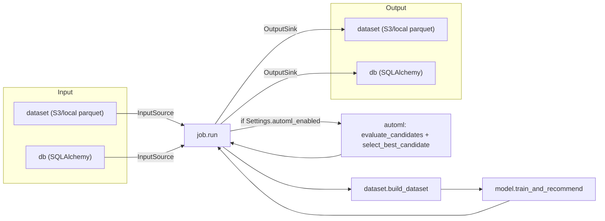

# Architecture

This document describes how the code under `src/cicerone/` fits together.
For configuration and usage, see the main [README](../README.md).

## Module overview

```
config.py            load & resolve config/cicerone.toml (structural config + ${ENV_VAR} secrets)
feature_config.py     load config/features.toml (event weights, feature columns)
io/
  base.py             InputSource / OutputSink protocols
  factory.py          picks a concrete backend by IOSettings.kind ("dataset" | "db")
  dataset_store.py     backend: parquet files (S3-compatible or local disk)
  db_store.py          backend: SQLAlchemy-backed database tables/queries
  options.py           shared "require_option" validation helper
dataset.py            raw events/users/items -> weighted rectools Dataset (BuiltDataset)
model.py            BuiltDataset -> STRATEGIES registry (collaborative/item_based/
                     popular/latest) -> top-K recommendations, combined per user
automl.py            optional: backtests candidate models/weights/rrf_k configs over
                     time-based folds of event history and picks the best one
job.py                orchestrates one end-to-end run (source -> dataset -> model -> sink)
scheduler.py           in-process cron loop that calls job.run() on config/cicerone.toml's cron_schedule
```

## Data flow



1. `job.run()` loads `Settings` (`config.load_settings`) and `FeatureConfig`
   (`feature_config.load_feature_config`), builds the configured
   `InputSource`/`OutputSink` via `io.factory`, and reads `events`
   (required) plus `users`/`items` (optional).
2. `dataset.build_dataset()` turns raw events into weighted interactions
   (event-type weights, quantity scaling, per-pair caps, exponential time
   decay — all driven by `FeatureConfig`) and explodes user/item feature
   columns into rectools' long format, then constructs a
   `rectools.dataset.Dataset`.
3. `model.train_and_recommend()` fits every strategy listed in
   `Settings.models` (`STRATEGIES` registry in `model.py`; defaults to
   `["collaborative", "popular"]`) and produces top-K recommendations:
   personalized strategies (`collaborative`, `item_based`) only run for "warm"
   users (any user present in the dataset, with or without interactions — see
   the cold-start note below); non-personalized strategies (`popular`,
   `latest`) run for every target user and backfill any warm user who didn't
   get enough personalized results after the availability filter. Strategies
   are combined either by priority order (default — earlier ones win ties)
   or, if `Settings.model_weights` is set (even an empty table), by weighted
   reciprocal rank fusion (`_combine_by_weighted_fusion`) — the fusion
   constant defaults to `model.RRF_K` but is overridable via
   `Settings.rrf_k`/`[job].rrf_k`; see the module docstring for the exact
   formula. When a fused (user, item) pair was produced by more than one
   strategy, its combined `source` label joins each contributing strategy's
   label in `enabled_models`' order (not alphabetically), so the label
   reflects the caller's configured priority.
   An optional `strategy_cache` parameter (keyed by strategy name, caching
   the *fitted model* rather than its `recommend()` output) lets a caller
   evaluating multiple configs against the same `BuiltDataset` — namely
   `automl.evaluate_candidates()` — skip re-fitting a strategy shared by
   more than one candidate; a cache hit still calls `recommend()` fresh, so
   it works even across candidates with different `top_k`/`weights`. Unused
   (`None`) by the single-config `job.py` call path.
4. If `Settings.automl_enabled` (`[job.automl].enabled`), before step 3
   `automl.evaluate_candidates()` backtests a list of candidate
   `models`/`weights`/`rrf_k` configs (defaults to `automl.DEFAULT_CANDIDATES`,
   overridable via `[[job.automl.candidates]]`) over `Settings.automl_n_splits`
   time-based folds of the raw event history — each fold trains a fresh
   `BuiltDataset` on everything before a `Settings.automl_test_days`-day
   held-out window and scores its recommendations against that window with
   `rectools.metrics` (MAP@k/NDCG@k/Recall@k). Within a fold,
   `evaluate_candidates()` passes a `strategy_cache` dict (reset per fold,
   shared across every candidate scored against that fold) to
   `train_and_recommend()` so candidates sharing a strategy reuse its fitted
   model instead of retraining it per candidate. `select_best_candidate()`
   then picks the highest scorer by `Settings.automl_primary_metric`
   (matched by prefix, e.g. `"MAP"` matches `"MAP@10"`), and its
   `models`/`weights`/`rrf_k` replace the static config for that run's call
   to `model.train_and_recommend()`.
5. `job.run()` writes the combined recommendations and a small run manifest
   (counts, timestamp, effective `models`/`model_weights`/`rrf_k`, and
   `automl_metrics` when AutoML ran) back out via the configured `OutputSink`.
6. `scheduler.main()` is the container's actual entrypoint: it computes the
   next run time from `cron_schedule` with `croniter`, sleeps, calls
   `job.run()`, and loops forever — a failed run is logged but never kills
   the loop.

## Extensibility: adding a new I/O backend

Input and output are each just a `kind` (string) + a free-form `options`
dict (`config.IOSettings`) — the config loader never needs to know what
keys a given backend requires. To add a new backend (e.g. a message queue):

1. Add a module under `src/cicerone/io/` implementing the `InputSource`
   and/or `OutputSink` protocol (`io/base.py`) — read `options` yourself,
   validating required keys with `io.options.require_option`.
2. Register the new `kind` string in `io/factory.py`'s
   `build_input_source`/`build_output_sink`.
3. Document the new `kind` and its `options` in `config/cicerone.toml`.

Nothing in `config.py`, `job.py`, `dataset.py`, or `model.py` needs to
change — they only ever see the `InputSource`/`OutputSink` protocol and the
generic `IOSettings`.

## Cold-start behavior

A user only counts as truly "cold" (popularity-only) if they're absent from
the dataset entirely — no interactions **and** no features. A user with
only features (no interactions) is still "warm" to LightFM via hybrid
cold-start and can get personalized recommendations. See
`model._recommendable_item_ids` and `model.train_and_recommend` for exactly
how warm/cold users and the availability filter interact.
