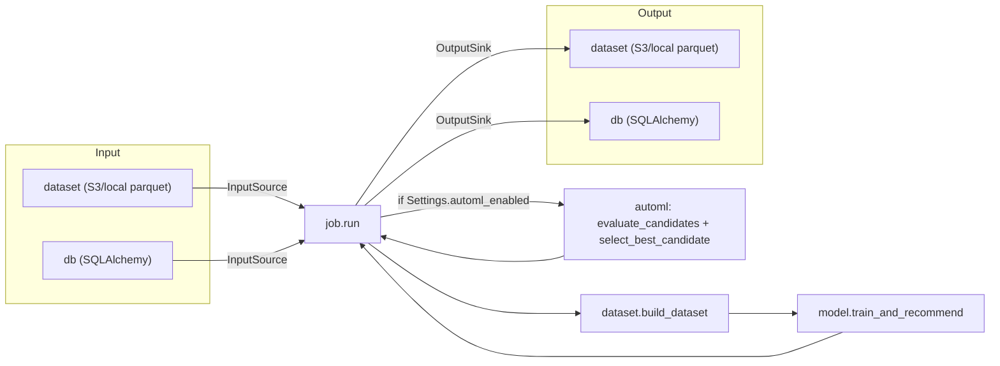

# Architecture

This document describes how the code under `src/cicerone/` fits together.
For configuration and usage, see the main [README](../README.md).

## Module overview

```
config.py            load & resolve config/cicerone.toml (structural config + ${ENV_VAR} secrets);
                     nested Serve/Trigger/Dashboard/AutoML settings (+ flat property aliases);
                     `ConfigError` for invalid knobs; `make_settings(**overrides)` for tests / OpenAPI export
feature_config.py     load config/features.toml (event weights, feature columns,
                     eligibility/boost policy rules; `[[boost]]` / `[[boosts]]`)
policy.py             declarative eligibility masks (documented fail-open/fail-closed matrix),
                     cohort grouping, score boosts
blending.py           per-user weighted mix of personalized/popular/latest (optional)
io/
  base.py             InputSource / OutputSink / RecommendationReader protocols
                      (including configure_item_filters);
                      BaseRecommendationReader with empty defaults for custom readers
  factory.py          kind→backend registry ("dataset" | "db")
  dataset_store.py     backend: parquet files (S3-compatible or local disk)
  db_store.py          backend: SQLAlchemy-backed database tables/queries
  recommendation_reader.py  read-only lookup of precomputed recs for serve mode (no rectools/lightfm import);
                      dataset path indexes by user_id at refresh; shared cold-start selection rule
  manifest_reader.py    read-only lookup of job-run manifests for the dashboard (no rectools/lightfm import)
  options.py           shared "require_option"/build_s3_client helpers
dataset.py            raw events/users/items -> weighted rectools Dataset (BuiltDataset;
                     keeps users+items frames for policy evaluation; caps keep most recent N)
model.py              BuiltDataset -> STRATEGIES registry (collaborative/item_based/
                     content_fallback/popular/latest) via RecTools
                     model_from_config -> cohort-aware recommend ->
                     combine/blend -> boosts (phased recommend_with_models)
model_config.py       default + TOML [model.*] RecTools configs; legacy
                     job.item_based.k_neighbors → model.K translation
                     (no rectools import — safe for serve)
content_fallback.py   optional content-based cold-item strategy (one-hot item
                     features + cosine vs user history)
artifact.py           optional versioned fitted-model bundle (RecTools
                     save/load_model for library models + recommend
                     without re-fitting); written by the batch job when enabled
automl.py            optional: backtests candidate models/weights/rrf_k configs over
                     time-based folds of event history and picks the best one
job.py                orchestrates one end-to-end run (source -> dataset -> model -> sink)
scheduler.py           in-process cron loop that calls job.run(); when [job.trigger]
                       is enabled, also hosts the retrain-trigger HTTP server (trigger.py)
serve.py               serve mode: FastAPI read API over precomputed recommendations
serve_schemas.py       Pydantic models that drive the serve OpenAPI schema
serve_client.py        thin stdlib HTTP client for the serve read API
export_serve_openapi.py  CLI to dump FastAPI's OpenAPI JSON (docs/openapi/…)
trigger.py             event-driven retrain trigger: webhook + optional input-bucket poll,
                       debounce guard (RunGuard) shared with the cron loop
http_auth.py           shared bearer-token (serve.py/trigger.py) and HTTP Basic Auth
                       (dashboard.py) dependencies
dashboard.py            standalone FastAPI dashboard: job status/history, own container/port
dashboard_users.py      load/save the dashboard's Basic Auth users file (TOML, username -> bcrypt hash)
manage_dashboard_users.py  CLI to add/remove/list dashboard users
templates/, static/      Jinja2 templates + vendored htmx/Stimulus/Tailwind assets for the dashboard
```

Local Docker Compose (`docker-compose.yml`) also offers an optional
`postgres` service under profile `db`
(`docker compose --env-file docker/postgres/defaults.env --profile db up -d postgres`)
so `kind = "db"` input/output can be exercised without an external database.
Credentials and database names live in `docker/postgres/defaults.env` (see
CONTRIBUTING.md). CI uses a separate throwaway instance via
`docker-compose.ci.yml`. The system-style check in `tests/test_system_db.py`
exercises the full job → recommendations/manifest/artifact →
serve/dashboard reader path against that real Postgres (resetting only
`cicerone.io.db_store.DEFAULT_DB_TABLES`).
## Data flow


```mermaid
flowchart LR
    subgraph Input
        S3["dataset (S3/local parquet)"]
        DB1["db (SQLAlchemy)"]
    end
    S3 -->|InputSource| J[job.run]
    DB1 -->|InputSource| J
    J -->|if Settings.automl_enabled| A[automl: evaluate_candidates + select_best_candidate]
    A --> J
    J --> D[dataset.build_dataset]
    D --> M[model.train_and_recommend]
    M --> J
    subgraph Output
        S3O["dataset (S3/local parquet)"]
        DB2["db (SQLAlchemy)"]
    end
    J -->|OutputSink| S3O
    J -->|OutputSink| DB2
```

1. `job.run()` loads `Settings` (`config.load_settings`) and `FeatureConfig`
   (`feature_config.load_feature_config`), builds the configured
   `InputSource`/`OutputSink` via `io.factory`, and reads `events`
   (required) plus `users`/`items` (optional).
2. `dataset.build_dataset()` turns raw events into weighted interactions
   (event-type weights, quantity scaling, per-pair caps, exponential time
   decay — all driven by `FeatureConfig`) and explodes user/item feature
   columns into rectools' long format, then constructs a
   `rectools.dataset.Dataset`.
3. `model.train_and_recommend()` fits every strategy listed in
   `Settings.models` (`STRATEGIES` registry in `model.py`; defaults to
   `["collaborative", "item_based", "popular"]`) and produces top-K
   recommendations. When `[job.content_fallback].enabled` is true,
   `content_fallback` is inserted before the first non-personalized
   strategy if not already listed. Personalized strategies
   (`collaborative`, `item_based`, `content_fallback`) only run for "warm"
   users (any user present in the dataset, with or without interactions — see
   the cold-start note below); non-personalized strategies (`popular`,
   `latest`) run for every target user and backfill any warm user who didn't
   get enough personalized results after eligibility filtering. Before
   `recommend()`, `policy.resolve_eligibility()` merges
   `item_availability_filters` sugar with explicit `[[eligibility]]` rules.
   User-scoped rules group target users into cohorts that share the same
   allowed item set (rectools accepts one `items_to_recommend` list per
   call); each cohort's allowlist is computed once and reused across
   every strategy. Strategies are then combined in one of three ways:
   - **Priority order** (default) — earlier strategies fill top-K first;
     later ones only backfill.
   - **Weighted RRF** — if `Settings.model_weights` is set (even an empty
     table), `_combine_by_weighted_fusion` sums `weight / (rrf_k + rank)`
     across strategies; `rrf_k` defaults to `model.RRF_K` and is
     overridable via `Settings.rrf_k`/`[job].rrf_k`. Combined `source`
     labels join contributing strategy labels in `enabled_models` order.
   - **Per-user blending** — if `FeatureConfig.blending.enabled`
     (`[blending]` in `features.toml`), `cicerone.blending` replaces the
     binary personalized-vs-popular choice with a gradual mix of
     `personalized`, `popular`, and (when `items` has a usable datetime
     column from `latest_date_columns`) date-based `latest`. A sigmoid or
     linear curve maps each user's distinct (user, item) count after
     aggregation → personalized weight; the remainder is split by
     `popular_share`. Availability / eligibility still filter every source
     *before* the blend; date-based `latest` is ranked **per cohort
     allowlist** (not a cross-cohort union). An item gets
     `source = "blended"` only when more than one source contributed it. A
     shared `__cold_start__` user is ranked against the global item-scoped
     allowlist for serve-mode fallback. When no date column is usable,
     `latest` is disabled and its weight moves to `popular`. Strategy
     `latest` (trending PopularModel) is skipped while blending is on.
   `Settings.max_workers` (`[job].max_workers`, default `1`) parallelizes
   AutoML fold evaluation and strategy fitting via `ProcessPoolExecutor`
   when set `>1`. Per-strategy top-K is rectools-native
   (`ModelBase.recommend()` maps external↔internal IDs via the Dataset's
   id maps — Cicerone does not hand-roll that conversion). When
   `[job].log_epoch_metrics = true`, the collaborative LightFM strategy is
   fitted epoch-by-epoch via `fit_partial` and logs in-sample
   Precision@K/Recall@K every `[job].epoch_metrics_every` epochs over a
   seeded random user sample (default off). Tunables are grouped in
   `EpochMetricsSettings`.
   If `[[boost]]` rules are configured, candidates are over-fetched by
   `FeatureConfig.boost_overfetch_factor` (default 3× `top_k`), scores are
   multiplied by the product of boost factors, and ranks are rewritten
   before truncating to `top_k`. Cohorts with an empty allowlist (eligibility
   filtered out every item) are skipped.
   An optional `strategy_cache` parameter (keyed by strategy name, caching
   the *fitted model* rather than its `recommend()` output) lets a caller
   who is evaluating multiple configs against the same `BuiltDataset` —
   namely `automl.evaluate_candidates()` — skip re-fitting a strategy shared
   by more than one candidate; a cache hit still calls `recommend()` fresh, so
   it works even across candidates with different `top_k`/`weights`. The
   batch job also passes a cache when `[job].save_model_artifact = true` so
   fitted weights can be serialized without a second fit.
4. If `Settings.automl_enabled` (`[job.automl].enabled`), before step 3
   `automl.evaluate_candidates()` backtests a list of candidate
   `models`/`weights`/`rrf_k` configs (defaults to `automl.DEFAULT_CANDIDATES`,
   overridable via `[[job.automl.candidates]]`) over `Settings.automl_n_splits`
   time-based folds of the raw event history — each fold trains a fresh
   `BuiltDataset` on everything before a `Settings.automl_test_days`-day
   held-out window and scores its recommendations against that window with
   `rectools.metrics` (MAP@k/NDCG@k/Recall@k). Within a fold,
   `evaluate_candidates()` passes a `strategy_cache` dict (reset per fold,
   shared across every candidate scored against that fold) to
   `train_and_recommend()` so candidates sharing a strategy reuse its fitted
   model instead of retraining it per candidate. `select_best_candidate()`
   then picks the highest scorer by `Settings.automl_primary_metric`
   (matched by prefix, e.g. `"MAP"` matches `"MAP@10"`), and its
   `models`/`weights`/`rrf_k` replace the static config for that run's call
   to `model.train_and_recommend()`.
5. `job.run()` writes the combined recommendations and a small run manifest
   (counts, timestamp, effective `models`/`model_weights`/`rrf_k`,
   `artifact_written` / `artifact_schema_version` when a model artifact was
   saved, and `automl_metrics` when AutoML ran) back out via the configured
   `OutputSink`. When items were loaded, it also writes an items snapshot
   (`items_snapshot.parquet` / `recommendation_items`) so serve mode can
   apply `?category=` and `exclude_unavailable` without reading the input
   store. When `Settings.save_model_artifact` is true, it also writes
   a versioned fitted-model artifact (`model.artifact` for the dataset
   backend, `model_artifacts` table for db) via
   `OutputSink.write_model_artifact`. Serve mode never loads this artifact.
6. `scheduler.main()` is the container's actual entrypoint for batch mode: it
   computes the next run time from `cron_schedule` with `croniter`, sleeps,
   calls `job.run(triggered_by="cron")`, and loops forever — a failed run is
   logged but never kills the loop. When `Settings.trigger_enabled`
   (`[job.trigger].enabled`), `scheduler.main()` instead delegates to
   `_run_with_trigger()`, which runs the same cron loop on a background
   thread and additionally serves `trigger.create_app()` (see below) in the
   main thread — both funnel through one `trigger.RunGuard` so at most one
   run happens at a time regardless of what triggered it.

## Serve mode and the retrain trigger

Selected via `[job].mode = "serve"`, `cicerone.serve` is a separate entrypoint
(`python -m cicerone.serve`) from the batch scheduler — a serve-only
deployment never imports `cicerone.model`/`dataset`/`automl` (no
rectools/lightfm/implicit needed in that process or its request path):

- `io.factory.build_recommendation_reader(settings.output)` builds a
  `RecommendationReader` (`io/recommendation_reader.py`) matching the
  configured output `kind` — `DatasetRecommendationReader` caches the whole
  parquet file (and optional `items_snapshot.parquet`) in memory and refreshes
  it on a background timer (`serve.py`'s `_start_refresh_loop`);
  `DbRecommendationReader` queries the recommendations table directly per
  request and caches the `recommendation_items` snapshot for filters.
- `serve.create_app()` exposes `GET /health` and
  `GET /recommendations/{user_id}` (`limit`/`k`, `category`,
  `exclude_unavailable`) behind `http_auth.require_bearer_token`. Unknown
  users fall back to the precomputed `__cold_start__` list rather than 404.
  Responses include `generated_at` from the run manifest. Pydantic models in
  `serve_schemas.py` populate `/openapi.json` (and `/docs` / `/redoc`);
  `export_serve_openapi` writes the checked-in copy under `docs/openapi/`.
  Integrators can call the same contract via `serve_client.ServeClient` or the
  snippets in `examples/serve/`.

`cicerone.trigger` implements the event-driven retrain trigger, additive to
(not a replacement for) `scheduler.py`'s cron loop:

- `RunGuard` (thread-safe) debounces concurrent trigger sources: a run
  already in flight, or one that finished within `debounce_seconds`, causes
  a new trigger to be skipped rather than queued or run in parallel.
- `create_app()` exposes `POST /trigger/retrain` (webhook, behind
  `http_auth.require_bearer_token`) which calls `guard.trigger("webhook")`.
- `poll_input_forever()` (only started when
  `Settings.trigger_poll_input_bucket`) periodically fingerprints the input
  source (`_current_marker`: local file mtime, or S3 `head_object`'s
  `LastModified`) and calls `guard.trigger("s3-poll")` when it changes. This
  is a deliberate substitute for real S3 event notifications, which require
  SNS/SQS/Lambda wiring and aren't portable across S3-compatible backends
  (R2, MinIO) — polling avoids adding that infra while still being
  event-driven from the operator's point of view.
- Every successful run's manifest (written by `job.run()`) records
  `triggered_by` (`"cron"`, `"webhook"`, or `"s3-poll"`).
- No new required infra: debounce state is a single in-process
  `threading.Lock`, which assumes one running instance of the scheduler
  process (the confirmed deployment topology for this repo).

## Dashboard

`cicerone.dashboard` is a standalone entrypoint (`python -m cicerone.dashboard`,
its own container/port `8090` in `docker-compose.yml`) for checking whether
the last job run succeeded — it is **not** gated by `[job].mode` like
serve/batch, so it's available even in plain batch-only deployments with no
other HTTP surface. Like `serve.py`, it never imports
`cicerone.model`/`dataset`/`automl`.

- `io.factory.build_manifest_reader(settings.output)` builds a
  `ManifestReader` (`io/manifest_reader.py`) matching the configured output
  `kind`: `DatasetManifestReader` only ever has the latest run (a `dataset`
  output's `manifest.json` is overwritten every run, not appended — no
  history for that backend), while `DbManifestReader` queries the
  `recommendation_runs` table for real history (`read_recent(limit)`).
- `job.run()` writes exactly one manifest per run via a `try`/`finally`,
  with a consistent key set (`status: "success"|"failed"`, `error`) on both
  the success and failure paths, so a failed run is no longer silently
  invisible to the dashboard.
- Auth is HTTP Basic (`http_auth.require_basic_auth`), not the bearer-token
  pattern used by serve/trigger — a browser-navigable page needs a login
  prompt, since a human can't attach a custom `Authorization` header to a
  plain top-level page load. Users live in a small TOML file
  (`dashboard_users.py`: username -> bcrypt hash) managed via the
  `manage_dashboard_users` CLI (`python -m cicerone.manage_dashboard_users
  --users-path <path> add <username>` — note `--users-path` must precede the
  subcommand, since it's a global `argparse` option).
- `dashboard.create_app()` exposes `GET /health` (no auth), `GET
  /partials/status` (Basic Auth, an htmx-polled fragment — see
  `templates/_status.html`), and `GET /dashboard` (Basic Auth, the full
  page). The page polls `/partials/status` via `hx-trigger="load, every Ns"`
  (`Settings.dashboard_refresh_interval_seconds`) instead of a websocket or
  client-side JS framework.
- Frontend stack: server-rendered Jinja2 templates + htmx (polling) +
  Stimulus (a small `time-ago` controller for relative timestamps) +
  Tailwind CSS, all vendored under `src/cicerone/static/` — no CDN at
  runtime and no Node/npm dependency at runtime or for end users. Tailwind
  is compiled ahead of time in a dedicated `frontend` Docker build stage
  (`node:22-slim`, pinned via `package.json`/`package-lock.json`) whose only
  output (`static/tailwind.css`) is copied into the runtime image.

## Business policies

`config/features.toml` can declare hard eligibility filters and soft ranking
boosts (`[[eligibility]]` / `[[boost]]`). These are evaluated in
`cicerone.policy` during `recommend_with_models` — not at serve time — so
precomputed recommendation rows already respect region/nationality gates,
paying-producer boosts, plan tiers, and similar ecommerce rules. See the
annotated recipes in `config/features.toml` and the README data-contract
section.

Implementation details:

- **Cohorts:** user-scoped eligibility groups target users by the
  fingerprint of the user attributes those rules read. Each cohort's
  allowed-item list is computed once and shared by every strategy's
  `recommend()` call.
- **Boost over-fetch:** when any `[[boost]]` is configured,
  strategies request `boost_overfetch_factor * top_k` candidates (default
  factor 3, set in `features.toml`) so a commercially boosted item that
  would otherwise sit just outside the raw top-K can still be promoted after
  score multiplication.
- **Empty cohorts:** if eligibility excludes every catalog item for a
  cohort, the allowlist is empty (logged once per such cohort) and that
  cohort is skipped — there is no silent fallback to the full catalog.
- **Missing columns:** a configured `item_column` absent from the items
  frame fails open (rule skipped). The warning is emitted once per
  `(kind, rule name, column)` for the process lifetime to avoid log spam
  when eligibility runs per cohort.
- **Artifacts:** schema version 2+ persists the `users` frame so
  `recommend_from_artifact` can re-apply user-scoped eligibility offline.

## Extensibility: adding a new I/O backend

Input and output are each just a `kind` (string) + a free-form `options`
dict (`config.IOSettings`) — the config loader never needs to know what
keys a given backend requires. To add a new backend (e.g. a message queue):

1. Add a module under `src/cicerone/io/` implementing the `InputSource`
   and/or `OutputSink` protocol (`io/base.py`) — read `options` yourself,
   validating required keys with `io.options.require_option`.
2. Register the new `kind` string in `io/factory.py`'s
   `build_input_source`/`build_output_sink`.
3. Document the new `kind` and its `options` in `config/cicerone.toml`.

Nothing in `config.py`, `job.py`, `dataset.py`, or `model.py` needs to
change — they only ever see the `InputSource`/`OutputSink` protocol and the
generic `IOSettings`.

## Cold-start behavior

A user only counts as truly "cold" (popularity-only) if they're absent from
the dataset entirely — no interactions **and** no features. A user with
only features (no interactions) is still "warm" to LightFM via hybrid
cold-start and can get personalized recommendations. See
`cicerone.policy.resolve_eligibility` / `allowed_items_for_cohort` and
`model.train_and_recommend` for exactly how warm/cold users and eligibility
interact.
