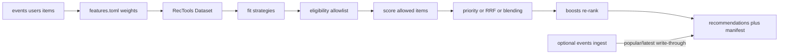

# How Cicerone works

Cicerone is a **batch hybrid recommender**. It reads interaction events,
weighs them, fits one or more strategies, combines those rankings into a
per-user top-K table, and writes that table. Optional serve mode is a
**read API over those rows** — `GET /recommendations/{user_id}` never runs
LightFM or SASRec.

Packages and I/O live in [architecture.md](architecture.md). Config knobs
live in the [README](../README.md). This page is the product and algorithm
story: what each strategy is, how they differ, and which papers or docs to
read next.

## Pipeline

1. Load `events` (required) plus optional `users` / `items`.
2. Turn raw events into weighted `(user, item)` pairs (`features.toml` +
   `[job].half_life_days`).
3. Fit every name in `[job].models` (RecTools `model_from_config`, plus
   in-repo `content_fallback`).
4. Resolve eligibility into a per-cohort allowlist **before** scoring: each
   strategy fills top-K from allowed items only, and a cohort whose allowlist
   is empty produces no rows at all.
5. Combine with **one** of: priority order, weighted reciprocal rank fusion,
   or per-user blending.
6. Apply boosts (soft re-rank) to the combined list.
7. Write `recommendations` + a run `manifest` (and an items snapshot so
   serve can filter by category / availability). After boosts,
   `[job.explain]` (default on) persists a `reasons` JSON column — see
   [Why this item](#why-this-item).

Full `job.run()` is the drift backstop (cron or `POST /trigger/retrain`).

## Interaction weighting

This runs **before** any model. Unknown `event_type`s are dropped.
Purchases and views are [implicit feedback](https://yifanhu.net/PUB/cf.pdf)
(Hu, Koren & Volinsky, 2008) — a weak yes, not a star rating. The table
below is Cicerone's weight recipe, not that paper's ALS.

| Step | Config | Effect |
| --- | --- | --- |
| Type weight | `[event_weights]` | Base weight per `event_type` |
| Quantity | `quantity_scaled_events` | Those types also scale by `log1p(quantity)` |
| Caps | `[event_caps]` | Keep the **most recent** N events per `(user, item, event_type)` |
| Recency | `[job].half_life_days` (default 90) | Exponential decay on `occurred_at` |
| Aggregate | always | One weight per `(user, item)` before RecTools `Dataset.construct` |

Aggregation is why **sequential sequences are unique items ordered by last
interaction**, not raw session streams with repeats. Tune the weights in
`config/features.toml`; see the README Interaction weights section.

## Strategies

`[job].models` picks which of these to fit. Default is
`["collaborative", "item_based", "popular"]`. Personalized strategies run
for warm users; `popular` / `latest` backfill. Hyperparameters stay in
`[model.<name>]` / `config/cicerone.toml` — this page does not repeat them.

| Name | Idea | Who it scores | Extra deps |
| --- | --- | --- | --- |
| `collaborative` | Hybrid matrix factorization + metadata | Warm users (interactions **or** features) | none |
| `item_based` | Item–item KNN on interaction vectors | Users with interactions | none |
| `sequential` | Transformer next-item on ordered history | Users with interactions | `cicerone-recommender[sequential]` |
| `content_fallback` | Cosine over item category features | Users with interactions; **cold catalog items** | none (in-repo) |
| `popular` | Global interaction counts | Everyone (non-personalized) | none |
| `latest` | Popularity in a recency window | Everyone (non-personalized) | none |

### `collaborative` — LightFM

RecTools [`LightFMWrapperModel`](https://rectools.readthedocs.io/en/stable/api/rectools.models.lightfm.LightFMWrapperModel.html)
(default WARP). LightFM embeds users, items, and **side features** in one
latent space, so a user with only profile columns (no purchases) can still
get personalized rows.

That is the difference vs `item_based` / `sequential` (those need
interaction history) and vs `popular` (no user vector at all). Cicerone
treats “warm” as *present in the dataset* — interactions **or** features.

Paper: [Kula, *Metadata Embeddings for User and Item Cold-start Recommendations*, 2015](https://arxiv.org/abs/1507.08439).
WARP loss: [Weston, Bengio & Usunier, IJCAI 2011](https://www.ijcai.org/Proceedings/11/Papers/460.pdf).

### `item_based` — item-item KNN

RecTools [`ImplicitItemKNNWrapperModel`](https://rectools.readthedocs.io/en/stable/api/rectools.models.implicit_knn.ImplicitItemKNNWrapperModel.html)
wrapping [`pm-implicit`](https://github.com/chezou/pm-implicit) `TFIDFRecommender`
(CUDA 12 fork of [`implicit`](https://github.com/benfred/implicit); import name is still `implicit`).
Each item is a vector of who interacted with it; neighbors are similar
items (`model.item_based.model.K`, default 20).

No latent factors, no time order, no item metadata. Independent of
`content_fallback` (that one ranks **unseen catalog** items by features).
Feature-only users skip this strategy.

Paper: [Sarwar et al., *Item-Based Collaborative Filtering Recommendation Algorithms*, WWW 2001](https://files.grouplens.org/papers/www10_sarwar.pdf).
Cicerone's neighbor model is TF-IDF item-item kNN, not that paper's cosine
over raw co-purchase counts.

### `sequential` — SASRec, BERT4Rec, or HSTU

Opt-in (`job.models`); not in the default chain. RecTools
[`SASRecModel`](https://rectools.readthedocs.io/en/stable/api/rectools.models.nn.transformers.sasrec.SASRecModel.html)
(default), `BERT4RecModel`, or `HSTUModel` via `[model.sequential].architecture`.
Needs `pip install 'cicerone-recommender[sequential]'` or
`pip install -r requirements-sequential.txt`. The default Docker image does
**not** install torch; serve never imports it.

SASRec defaults follow RecTools eSASRec (`sampled_softmax` + LiGR layers).
Sequences are **distinct items sorted by last-touch time** after aggregation —
not a click stream with repeats — so HSTU relative-time bias is weak here.

| | SASRec | BERT4Rec | HSTU |
| --- | --- | --- | --- |
| Attention | Unidirectional (causal) | Bidirectional | Pointwise; optional relative time/position |
| Training | Shifted sequence: predict the next item | Cloze / item masking (MLM) | Shifted sequence (SASRec-style) |
| Typical use | Next-item from left context | Fill-in from both sides | Next-item; time bias needs raw event order |

Papers: [Kang & McAuley, SASRec, 2018](https://arxiv.org/abs/1808.09781);
[Sun et al., BERT4Rec, 2019](https://arxiv.org/abs/1904.06690);
[Zhai et al., HSTU, 2024](https://arxiv.org/abs/2402.17152). RecTools
walkthrough:
[transformer tutorial](https://rectools.readthedocs.io/en/stable/examples/tutorials/transformers_tutorial.html).

AutoML **drops** `sequential` (INFO log) when torch is missing or median
distinct items/user is below `[job.sequential].min_median_interactions`
(default 5). Sparse catalogs should leave it off.

### `content_fallback` — cold catalog items

In-repo cosine similarity: one-hot **categorical / list** `item_features`
vs the user’s recent history (capped). Recommends items with **zero
interactions** — new SKUs, not new users. Not text TF-IDF. Off unless
`[job.content_fallback].enabled = true` (then inserted before the first
non-personalized strategy if you did not list it in `models`).

### `popular` and `latest`

Both are RecTools
[`PopularModel`](https://rectools.readthedocs.io/en/stable/api/rectools.models.popular.PopularModel.html).
`popular` is global counts. `latest` restricts to a window (`period = { days = 14 }`
by default) — trending, not an embedding of recency.

**Two different “latest” ideas:** the `latest` **strategy** is windowed
popularity on interactions. Per-user **blending** can also rank by item
datetime columns (`published_at`, …). While blending is on, the `latest`
*strategy* is skipped so those two rankings do not fight. Incremental
events refresh popular/latest **slices** of the written table — they do
not re-fit LightFM.

## Combining strategies

Only one combiner is in charge.

**Priority** (default). Earlier `[job].models` fill top-K first; later
names only backfill. Duplicate `(user, item)` keeps the earlier source.

**Weighted RRF.** Set `[job.model_weights]`. Each strategy contributes
`weight / (rrf_k + rank)` (default `rrf_k = 60`); scores sum. Heterogeneous
raw scores never need aligning. `source` becomes a `+`-joined label in
`models` order (for example `popular_fallback+latest`). An empty
`[job.model_weights]` table still enables fusion at weight `1.0`. Classic
reciprocal rank fusion: [Cormack, Clarke, Buettcher, SIGIR 2009](https://dl.acm.org/doi/10.1145/1571941.1572114).

**Per-user blending.** `[blending]` in `features.toml`. Personalized weight
grows with the user’s distinct `(user, item)` count (linear or sigmoid);
the remainder splits between `popular` and date-based `latest`. Cold /
low-history users lean non-personalized without a hard cutoff. If both RRF
and blending are set, blending wins and the job logs a warning.

To compare two combiners (or two model lists) on live traffic, use
`[experiment]` — a sticky user hash onto whole recipes, not a post-hoc
source attribution chart. See [experiments.md](experiments.md).

## Policies

Evaluated at **batch recommend time**. Serve does not re-run eligibility or
boosts (it can still filter the items snapshot with `?category=` and
`exclude_unavailable`).

- **Eligibility** — hard allowlist. Users with the same attributes share a
  cohort and one `items_to_recommend` set. Empty allowlist → that cohort is
  skipped (no silent fallback to the full catalog).
- **Boosts** — multiply scores after over-fetching
  (`boost_overfetch_factor` × `top_k`, default 3), re-rank, truncate.
  Commercial overlay; `source` stays a strategy name.

Recipes: `config/features.toml` and the README Business policies section.

## Why this item

Serve cannot reconstruct a model-level explanation on the request path.
When `[job.explain]` is on (default), the batch job writes a `reasons`
JSON column: contributing sources (rank / weight / RRF term), boost rules
that changed the score, and similar history items plus shared catalog
attributes (Jaccard over the same item-feature tokens as content fallback).
`source` is unchanged. Disable with `[job.explain].enabled = false`.
Existing DB recommendation tables need `ALTER TABLE … ADD COLUMN reasons TEXT`.

## AutoML

`[job.automl]` backtests candidate `models` / `weights` / `rrf_k` over
time folds of your events (`MAP` / `NDCG` / `Recall` via RecTools metrics)
and picks the winner for that run. Set `[job.automl].debias = true` to pass
RecTools `DebiasConfig` into those metrics (default off). It is not a neural
architecture search.
Fitted models **and** per-strategy `recommend()` frames are reused across
candidates within a fold; only the combination step is recomputed. Sequential
skip rules above still apply.

## Incremental vs full retrain

`[events]` refreshes **popular / latest slices** (and recency boosts) for
affected users plus `__cold_start__`. Collaborative, item-KNN, sequential,
and content-fallback rows wait for the next full `job.run()` — LightFM has
no clean online `partial_fit` on this path. Operator guide:
[incremental-events.md](incremental-events.md).

## Cold-start

A user is truly cold only if they are **absent** from the dataset (no
interactions **and** no features). Feature-only users are warm for LightFM.
Serve / dashboard answer an unknown `user_id` with `fallback: true` rather
than a bare 404 — when there is something to fall back to. The job writes the
`__cold_start__` set **only under blending**; incremental events then keep it
fresh. Under priority or RRF that sentinel is absent, so the reader
substitutes one `popular_fallback` / `latest` user's top-K, and 404s if the
table has neither.
