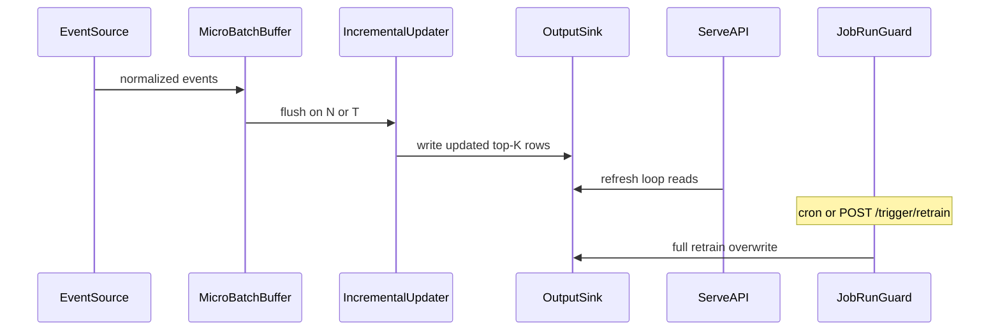

# Incremental events

Cicerone can fold new interaction events into recommendations between full
batch retrains. This document is the design source of truth; runtime code
lives under `src/cicerone/events/`.

For the batch I/O and serve overview, see [architecture.md](architecture.md).

## Goals

- React to interaction events from multiple sources without waiting for the
  next cron / retrain-webhook full `job.run()`.
- Keep update logic **backend-agnostic**: every source normalizes to the
  existing event contract before anything hits the incremental path.
- Preserve today’s trainer vs serve split: serve stays a read API over
  precomputed rows (no live LightFM inference on the request path).

## Non-goals (for now)

- Dynamic loading of third-party / external plugin packages.
- `importlib.metadata` entry-point discovery for outside authors.
- A plugin marketplace. Cicerone holds DB/S3/broker credentials; untrusted
  external code is out of scope.

The `EventSource` surface is an **internal** interface so built-in backends
stay consistent — the same spirit as `io/` `kind` + `options`, not a public
extension API.

## Event contract

Same columns as batch input (`dataset.py` / README data contract):

| Column | Required | Notes |
| --- | --- | --- |
| `user_id` | yes | string |
| `item_id` | yes | string |
| `event_type` | yes | must appear in `features.toml` `[event_weights]` to affect weights |
| `quantity` | no | default `1` |
| `occurred_at` | yes | timezone-aware UTC datetime |

Optional transport fields (not part of the training contract):

- `event_id` — idempotency / ack key (generated if omitted)
- `idempotency_key` — alias accepted by the webhook JSON body

## Package layout

```
src/cicerone/events/
  base.py        # EventSource protocol, NormalizedEvent, EventSourceHealth
  registry.py    # kind → factory (import-time; no external entry-points)
  normalize.py   # coerce payloads → NormalizedEvent (+ light dedupe helpers)
  buffer.py      # micro-batch by count or time window
  updater.py     # cheap incremental path → OutputSink (write-through)
  store.py       # load existing recommendation rows for merge
  webhook.py     # reference EventSource (HTTP push)
  worker.py      # background poll → buffer → flush → ack

src/cicerone/serve/
  events_routes.py      # POST /events mount
  bootstrap_events.py   # start/stop EventWorker in the serve process

src/cicerone/config/events.py  # [events] coerce + TOML load helpers
```

Later backends (`db`, `s3`, `rabbitmq`, `kafka`, `redis_streams`) register
beside `webhook` without changing the config shape.

## EventSource surface

```text
connect() -> None
poll(max_events) -> Sequence[NormalizedEvent]
ack(event_ids) -> None
health() -> EventSourceHealth  # connected, lag/backlog, last_event_at
```

Push backends (webhook) also expose `ingest(...)` for the HTTP handler;
`poll`/`ack` still drive the shared worker so pull backends share one loop.

Registry: `register_event_source(kind, factory)` at import time;
`build_event_source(settings)` looks up `settings.events.kind`. Unknown
kinds raise `ValueError` — no growing if/elif in the config loader.

## Config

```toml
[events]
enabled = false
kind = "webhook"   # webhook | db | s3 | rabbitmq | kafka | (later redis_streams)

[events.options]
# backend-specific; webhook may set auth_token (else serve.auth_token)

[events.incremental]
batch_size = 100
batch_window_seconds = 60
```

Full retrain remains `[job]` cron + `[job.trigger]` (`POST /trigger/retrain`
and optional input-bucket poll). That path is the drift backstop; incremental
updates are a separate cheap path between full runs.

## Incremental strategy

**Micro-batch** (count *or* time window), then a lightweight update:

| Strategy | Incremental behavior |
| --- | --- |
| Popular / latest | Cheap count / recency updates from the flushed batch |
| Item KNN / content | Future: co-occurrence / feature touch-ups; v1 leaves existing rows |
| LightFM (`collaborative`) | No clean `partial_fit` — **not** updated online; waits for full retrain |

v1 updater: merge flushed events into existing top-K rows for **affected
users** and `__cold_start__` by refreshing `popular_fallback` / `latest`
slices (and boosting recently interacted items), then **write-through** via
the same `OutputSink` the batch job uses. Personalized / `item_based` rows
are preserved until the next full retrain.

Serve keeps its refresh loop — no in-process model swap. That preserves
separate trainer/serve containers and “serve request path never loads
LightFM.”



When a full `job.run()` holds `RunGuard`, incremental flushes skip (events
stay un-acked / buffered) so the batch write is not interleaving with a
partial merge. If serve and trainer are separate processes, last writer
wins; the next full retrain remains the consistency backstop.

## Backend roadmap

Build order:

1. **Webhook / HTTP push** (`POST /events` on the serve app) — no new
   runtime dependency; mirrors the retrain-webhook pattern.
2. **DB** — watermark poll (reuse `events_query`); optional LISTEN/NOTIFY or
   logical replication under the **same** `kind=db` (not a separate kind).
3. **S3** — AWS: notifications → SQS; non-AWS (R2/MinIO): list/marker poll.
4. **RabbitMQ** — queue/exchange consumer (optional dep).
5. **Kafka** — topic / consumer group (optional dep).

### Broker recommendation

For greenfield self-host at this project size, prefer **Redis Streams** as
the default *broker-based* backend once implemented: consumer groups,
lag introspection, and a small ops footprint — especially if Redis already
sits near the stack (optional distributed lock). **NATS/JetStream** is the
next-best lightweight alternative. Keep Kafka/RabbitMQ for shops that
already run them; do not steer greenfield users there first.

| Path | New host/image deps? |
| --- | --- |
| Webhook + micro-batch | None (FastAPI already present) |
| DB poll | None beyond SQLAlchemy |
| S3 + SQS / poll | boto3 already present |
| RabbitMQ | optional `requirements-rabbitmq.txt` |
| Kafka | optional `confluent-kafka` extra |
| Redis Streams | `redis` (already optional for locks) |

## Delivery semantics

| Source | Typical delivery | Idempotency approach |
| --- | --- | --- |
| Webhook | At-least-once (client retries) | `event_id` / `idempotency_key`; short dedupe window |
| DB watermark | Near exactly-once | Advance watermark only after successful flush |
| S3→SQS / poll | At-least-once | Object key + etag dedupe |
| RabbitMQ / Kafka | At-least-once | Ack/commit after successful flush; shared dedupe key |

Duplicate delivery can inflate weights for `quantity_scaled_events`. Dedupe
belongs in the shared normalize/buffer path, not per backend.

## Ops

Extend existing Prometheus metrics and the Basic-Auth dashboard (no separate
ops surface): event-source lag/backlog, last incremental success time,
flush/error counters — beside current job status. (Metrics/dashboard wiring
lands in a follow-up PR after the webhook + updater path.)

## Serve webhook

When `[events] enabled = true` and `kind = "webhook"`, the serve process
exposes `POST /events` (Bearer auth: `events.options.auth_token` or
`serve.auth_token`). Body: one event object or `{"events":[...]}`.
Accepted events are normalized, queued on the webhook `EventSource`, and
drained by the micro-batch worker.
