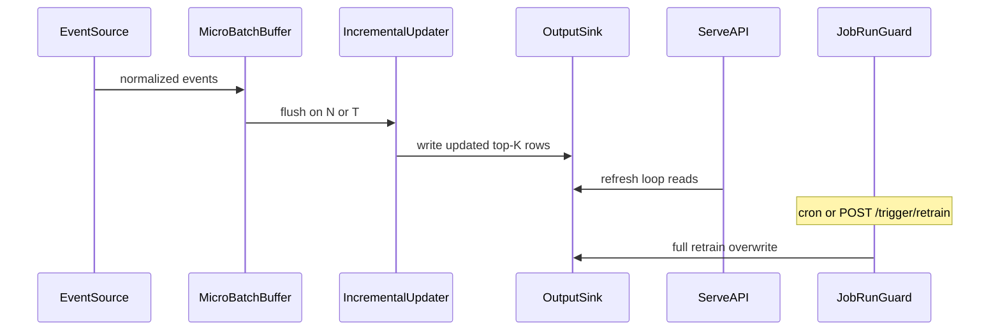

# Incremental events

Cicerone can fold new interaction events into recommendations between full
batch retrains. This document is the design source of truth; runtime code
lives under `src/cicerone/events/`.

For the batch I/O and serve overview, see [architecture.md](architecture.md).

## Goals

- React to interaction events from multiple sources without waiting for the
  next cron / retrain-webhook full `job.run()`.
- Keep update logic **backend-agnostic**: every source normalizes to the
  existing event contract before anything hits the incremental path.
- Preserve today’s trainer vs serve split: serve stays a read API over
  precomputed rows (no live LightFM inference on the request path).

## Non-goals (for now)

- Dynamic loading of third-party / external plugin packages.
- `importlib.metadata` entry-point discovery for outside authors.
- A plugin marketplace. Cicerone holds DB/S3/broker credentials; untrusted
  external code is out of scope.

The `EventSource` surface is an **internal** interface so built-in backends
stay consistent — the same spirit as `io/` `kind` + `options`, not a public
extension API.

## Event contract

Same columns as batch input (`dataset.py` / README data contract):

| Column | Required | Notes |
| --- | --- | --- |
| `user_id` | yes | string |
| `item_id` | yes | string |
| `event_type` | yes | must appear in `features.toml` `[event_weights]` to affect weights |
| `quantity` | no | default `1` |
| `occurred_at` | yes | timezone-aware datetime (ISO-8601 with `Z` or offset; Unix epoch seconds (UTC) OK) |

Optional transport fields (not part of the training contract):

- `event_id` — idempotency / ack key (generated if omitted)
- `idempotency_key` — alias accepted by the webhook JSON body

## Package layout

```
src/cicerone/events/
  base.py        # EventSource protocol, NormalizedEvent, EventSourceHealth
  registry.py    # kind → factory (import-time; no external entry-points)
  normalize.py   # coerce payloads → NormalizedEvent (+ light dedupe helpers)
  buffer.py      # micro-batch by count or time window
  updater.py     # cheap incremental path → OutputSink (write-through)
  store.py       # load existing recommendation rows for merge
  webhook.py     # HTTP push EventSource
  db.py          # watermark poll EventSource
  s3.py          # S3-compatible EventSource (R2 list/marker; optional AWS SQS)
  worker.py      # background poll → buffer → flush → ack

src/cicerone/serve/
  events_routes.py      # POST /events mount
  bootstrap_events.py   # start/stop EventWorker in the serve process

src/cicerone/config/events.py  # [events] coerce + TOML load helpers
```

Built-in backends (`webhook`, `db`, `s3`; later `rabbitmq` / `kafka` /
`redis_streams`) register beside each other without changing the config shape.

## EventSource surface

```text
connect() -> None
poll(max_events) -> Sequence[NormalizedEvent]
ack(event_ids) -> None
health() -> EventSourceHealth  # connected, lag/backlog, last_event_at
```

Push backends (webhook) also expose `ingest(...)` for the HTTP handler;
`poll`/`ack` still drive the shared worker so pull backends share one loop.

Registry: `register_event_source(kind, factory)` at import time;
`build_event_source(settings)` looks up `settings.events.kind`. Unknown
kinds raise `ValueError` — no growing if/elif in the config loader.

## Config

```toml
[events]
enabled = false
kind = "webhook"   # webhook | db | s3 | rabbitmq | kafka | (later redis_streams)

[events.options]
# backend-specific; webhook may set auth_token (else serve.auth_token)
# db: database_url (required), events_table / events_query, watermark_path,
#     initial_watermark
# s3 (R2-first): access_key_id, secret_access_key, bucket (required);
#     endpoint_url (R2/MinIO); prefix; mode = "list" | "sqs" (default: list
#     unless queue_url set); marker_path / initial_marker (list).
#     AWS-only: queue_url + mode = "sqs" (rejected when endpoint_url is set)

[events.incremental]
batch_size = 100
batch_window_seconds = 60
```

Full retrain remains `[job]` cron + `[job.trigger]` (`POST /trigger/retrain`
and optional input-bucket poll). That path is the drift backstop; incremental
updates are a separate cheap path between full runs.

## Incremental strategy

**Micro-batch** (count *or* time window), then a lightweight update:

| Strategy | Incremental behavior |
| --- | --- |
| Popular / latest | Cheap count / recency updates from the flushed batch |
| Item KNN / content | Future: co-occurrence / feature touch-ups; v1 leaves existing rows |
| LightFM (`collaborative`) | No clean `partial_fit` — **not** updated online; waits for full retrain |

v1 updater: merge flushed events into existing top-K rows for **affected
users** and `__cold_start__` by refreshing `popular_fallback` / `latest`
slices (and boosting recently interacted items), then **write-through** via
the same `OutputSink` the batch job uses. Personalized / `item_based` rows
are preserved until the next full retrain.

Serve keeps its refresh loop — no in-process model swap. That preserves
separate trainer/serve containers and “serve request path never loads
LightFM.”



When a full `job.run()` holds `RunGuard` **in the same process**, pass
`busy_check=guard.busy` into `start_events_runtime` / `IncrementalUpdater`
so flushes skip. Serve and trainer are usually separate containers — then
last writer wins and the next full retrain remains the consistency backstop.
Do not treat cross-process exclusion as automatic.

Webhook options may set `max_pending` (default 10000, minimum 100) for ingest
backpressure (HTTP 429 when full). Worker poll interval is
`events.incremental.poll_interval_seconds`.

The updater caches the recommendations frame in-process between micro-batches
and refreshes that cache after each successful write. A same-process
`busy_check` hit invalidates the cache so the next apply reloads after retrain.
User-scoped reads/writes (instead of full-frame merge + overwrite) remain a
follow-up.

## Follow-up PR sequence

Keep each PR **atomic** and stacked on the incremental-events foundation
(`feature/events-incremental` / its successors), not a grab-bag onto `main`:

1. Webhook + micro-batch write-through (foundation) — shipped
2. `kind=db` watermark source — shipped
3. Metrics / dashboard wiring (lag, flush, errors) — shipped
4. Further backends / write-path improvements as separate PRs (`kind=s3`
   shipped; user-scoped I/O, Redis Streams, …)
5. **Last:** full review of `docs/` **and** the `website/` sync (sidebar,
   `sync-docs.mjs`, rendered pages, links, OpenAPI mentions) so the public
   site matches the shipped incremental surface

## Backend roadmap

Build order:

1. **Webhook / HTTP push** (`POST /events` on the serve app) — shipped.
2. **DB** — watermark poll (reuse `events_query` / `events_table`); optional
   `watermark_path` for durable cursor; LISTEN/NOTIFY or logical replication
   under the **same** `kind=db` later (not a separate kind).
3. **S3-compatible (R2-first)** — shipped: primary path is list/marker poll
   (`mode=list`) with the same `endpoint_url` + credentials shape as dataset
   I/O (Cloudflare R2 / MinIO). Optional AWS-only `mode=sqs` (S3→SQS
   notifications; rejected when `endpoint_url` is set). Objects are JSON
   event objects or arrays; missing `event_id` uses `bucket/key|etag|index`.
4. **RabbitMQ** — queue/exchange consumer (optional dep).
5. **Kafka** — topic / consumer group (optional dep).

### Broker recommendation

For greenfield self-hosted deployments at this project size, prefer **Redis Streams** as
the default *broker-based* backend once implemented: consumer groups,
lag introspection, and a small ops footprint — especially if Redis already
sits near the stack (optional distributed lock). **NATS/JetStream** is the
next-best lightweight alternative. Keep Kafka/RabbitMQ for shops that
already run them; do not steer greenfield users there first.

| Path | New host/image deps? |
| --- | --- |
| Webhook + micro-batch | None (FastAPI already present) |
| DB poll | None beyond SQLAlchemy |
| S3-compatible list / AWS SQS | boto3 already present |
| RabbitMQ | optional `requirements-rabbitmq.txt` |
| Kafka | optional `confluent-kafka` extra |
| Redis Streams | `redis` (already optional for locks) |

## Delivery semantics

| Source | Typical delivery | Idempotency approach |
| --- | --- | --- |
| Webhook | At-least-once (client retries) | `event_id` / `idempotency_key`; short dedupe window |
| DB watermark | Near exactly-once | Advance watermark only after successful flush |
| S3 list (R2) / SQS | At-least-once | Object key + etag dedupe |
| RabbitMQ / Kafka | At-least-once | Ack/commit after successful flush; shared dedupe key |

Duplicate delivery can inflate weights for `quantity_scaled_events`. Dedupe
belongs in the shared normalize/buffer path, not per backend.

## Ops

Extend existing Prometheus metrics and the Basic-Auth dashboard (no separate
ops surface). Serve `/metrics` exposes:

| Metric | Meaning |
| --- | --- |
| `cicerone_events_source_lag` | Source backlog (`-1` if unknown / events off). Webhook/S3-list: pending + in-flight. S3-SQS: approximate queue depth. DB: rows after watermark. |
| `cicerone_events_source_connected` | `1` when the source reports connected |
| `cicerone_events_flush_total{status=}` | Flush outcomes: `success` / `busy` / `error` |
| `cicerone_events_flush_events_total` | Events applied on successful flushes |
| `cicerone_events_last_success_timestamp_seconds` | Last successful flush (Unix seconds) |
| `cicerone_events_tick_errors_total` | Unexpected exceptions outside handled flush paths |

The worker refreshes lag/connected each poll cycle (not on `/metrics` scrape),
so DB `health()` work stays off the Prometheus path. Flush apply/partial
failures increment `flush_total{status="error"}` only (they do not also bump
tick errors).

The dashboard (when `[events] enabled`) shows the latest incremental
**success** from recent manifests beside job status; live lag stays on serve
`/metrics`. With a dataset output, a later full retrain overwrites
`manifest.json`, so the panel may go empty until the next incremental flush
(prefer a DB output for history).

## Serve webhook

When `[events] enabled = true` and `kind = "webhook"`, the serve process
exposes `POST /events` (Bearer auth: `events.options.auth_token` or
`serve.auth_token`). Body: one event object, a list, or `{"events":[...]}`.
Accepted events are validated (OpenAPI models), normalized, queued on the
webhook `EventSource`, and drained by the micro-batch worker. A full backlog
(`max_pending`) returns **429**.

When `kind = "db"`, the same worker polls interaction rows after a watermark
(`events.options.database_url`, optional `events_table` / `events_query`,
optional durable `watermark_path`). The watermark advances only on successful
``ack`` after a flush. Health lag uses the same `(occurred_at, event_id)`
cursor as poll: SQL ``COUNT`` when an ``event_id`` column is present (except
SQLite, where timestamp binding is unreliable), otherwise a bounded row scan
that synthesizes ids like poll. If that scan hits its row cap, ``health().lag``
is ``None`` (unknown / too large) rather than a truncated count. Poll selects
only the columns used for normalization. Corrupt ``watermark_path`` files are
logged and ignored so ``connect()`` can still succeed. ``events_query``, when
set, must be a single read-only ``SELECT`` from **trusted deploy-time config**
(interpolated into SQL like ``input.options.events_query`` — not end-user
input). Naive SQL ``datetime`` values are treated as UTC; timezone-less
*strings* (config / JSON watermark) are rejected.
